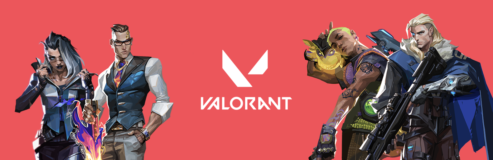

## Hi, I tried to code the VALORANT client homepage in pure HTML/CSS without JS

<b><a href="https://playvalorant.com">VALORANT</a></b> is a first-person shooter game developed by Riot Games. 
In this project I tried to reproduce the client's home page in HTML and CSS as faithfully as possible with these interactions and animations but without using JavaScript. 
You can see the website in action at https://helie-deschamps.github.io/VALORANT_HTML_Client/ 
<em>This project isn’t endorsed by Riot Games and doesn’t reflect the views or opinions of Riot Games or anyone officially involved in producing or managing VALORANT. VALORANT and Riot Games are trademarks or registered trademarks of Riot Games, Inc. League of Legends © Riot Games, Inc.</em>
